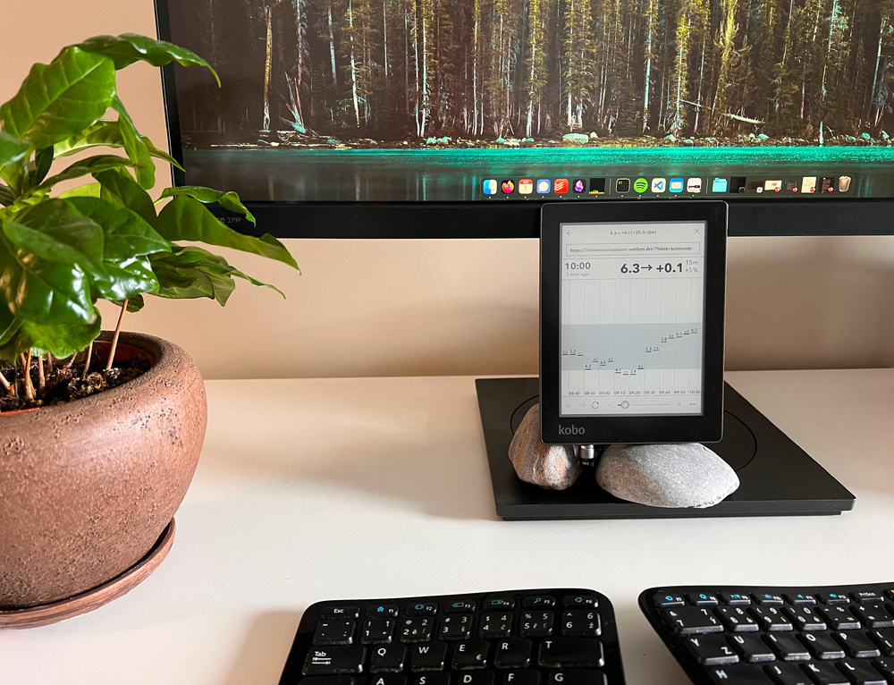
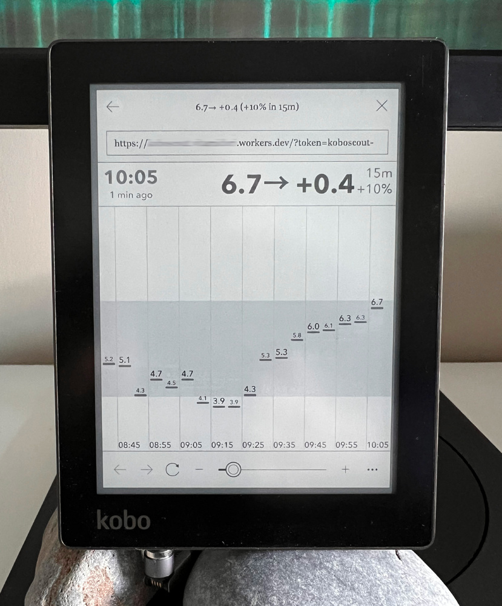

# Koboscout

## Overview

Koboscout is a web application that displays a simple chart of your latest Continuous Glucose Monitoring (CGM) on an e-reader, such as a Kobo device. It is a way of making glucose readings 'ambient' – quietly present in your environment without actively clamouring for attention.

I usually leave my Koboscout on my desk when I work. It just sits there, quietly updating every five minutes. Because it's a monochrome e-ink display it just blends in, like a small framed picture.

I made Koboscout for myself but am sharing it to inspire others. You can build your own ambient app, or perhaps even run Koboscout itself in your own environment and on your own hardware.

## Features

- Loads the last 90 minutes of CGM data from your own Nightscout instance and displays it in a chart.
- Highlights the target range you have configured in Nightscout.
- Units (mg/dl or mmol/l) are also taken from Nightscout configuration.
- There are no high/low alerts, by design. It is enough to be bombarded by the CGM app and the insulin pump already!

## Running Koboscout

Running Koboscout is a bit involved because you need three components to work in sync:
1. Your Nightscout instance.
2. Koboscout backend app which, upon request, downloads CGM data from Nightscout and packages them into a simple
   web page showing the chart.
3. Hardware device such as an e-reader or a tablet that connects to the backend app and keeps displaying it.

### 1. Nightscout
To provide access to your Nightscout data, you need to check two things:

1. Find your Nightscout instance address (URL).
2. Create an **access token** which Koboscout will use as a password when talking to Nightscout.
    - You can create a token by going to your Nightscout menu > Admin Tools > Subjects - People, Devices > Add new Subject.
    - Set `Name` to whatever you like, e.g. `koboscout`.
    - Set `Roles` to `readable`.

### 2. Koboscout deployment
The Koboscout app is extremely light-weight: all it needs to is to download CGM data from Nightscout
and reformat it into a simple HTML page. I run mine as a 'serverless' app on the
[Cloudflare Workers platform](https://workers.cloudflare.com/) which costs me literally $0 per month.

You can simply create your own Workers app, upload Koboscout using Cloudflare's `wrangler` tool,
and get your very own backend address that you can then use in step 3 to display data on your device.

Koboscout needs Nightscout credentials from step 1. For simplicity, I recommend setting the `NIGHTSCOUT_URL` environment
variable as a [regular variable](https://developers.cloudflare.com/workers/configuration/environment-variables/)
or a [secret](https://developers.cloudflare.com/workers/configuration/secrets/).
You can also store the Nightscout access token in the `NIGHTSCOUT_TOKEN` secret variable and be done with it.
However, I recommend plugging it into the Koboscout address instead, e.g. `https://my-koboscout.example.workers.dev/?token=secret-12345`.
That way, even if somebody discovers your Worker address (`https://my-koboscout.example.workers.dev`) it will not
leak any data from your Nightscout until the access token is provided as well.

You can, of course, run the app somewhere else than Cloudflare Workers. The entrypoint is `index.ts` and should be trivial to modify.

### 3. E-reader
I bought a second-hand Kobo Aura for this. I keep it on a charger on my desk because with Koboscout running
and refreshing data every 5 minutes, the otherwise energy-conserving e-reader can burn through its battery
within a single day.

I had expected I'd have to [modify all kinds of things on the device](https://wiki.mobileread.com/wiki/Kobo_eReader_hacks)
but in the end, very little was needed to set this up:
- Disable any kind of device/display sleep (Settings > Energy saving and privacy)
- [Enable developer mode](https://wiki.mobileread.com/wiki/Kobo_eReader_hacks#devmode) and then force WiFi to remain *on* at all times (Settings > Device information > Developer options).

To run Koboscout, you just open the Web browser (found in the *Beta Features* menu), type in the address of your
Koboscout backend, and leave it running. The page will refresh itself, as long as the WiFi connection stays good.
You may need to include your Nightscout token (or even Nightscout URL) in the address if you had not set them
already in your Koboscout deployment, step 2.

It is very practical to set the Koboscout address (perhaps including the Nightscout token) as your home
page in the e-reader browser.

## Limitations & what's missing

- All chart dimensions are hardcoded (in the [config.ts](./src/config.ts) file) and work for my Kobo Aura.
  If you have a different device, tweak these dimensions to fit your screen.
- Gaps between missing values are not visualised. At the moment, Koboscout displays one CGM value after another,
  without regard for how much time has elapsed between them. It would be better to visually indicate
  gaps in the chart.
- All times are in the 24-hour format for now. No AM/PM clock format.

## See also

I have also built [Glucoscape](https://github.com/vitawasalreadytaken/glucoscape), a purely software
solution for visualising CGM time in range.

## Contributing

I welcome contributions from the community. If you have suggestions, bug reports, or would like to contribute code, please open an issue or pull request here on GitHub.

### Development
Be prepared that if you display the web application on an e-reader, its web browser may be very obsolete.
At least that is the case with my Kobo Aura, even though it runs regularly updated firmware.
For this reason the application is mostly server-side, and the JavaScript running in the browser
only does the bare minimum. Funnily, the "chart" is "drawn" with absolutely-positioned `
`s...

## License

This project is licensed under the MIT License - see the LICENSE file for details.
